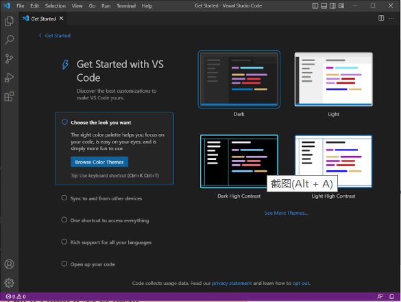
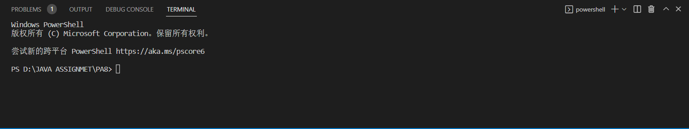
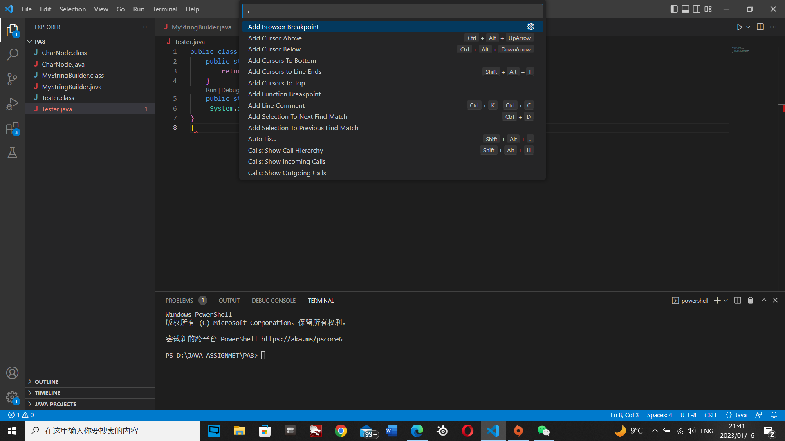
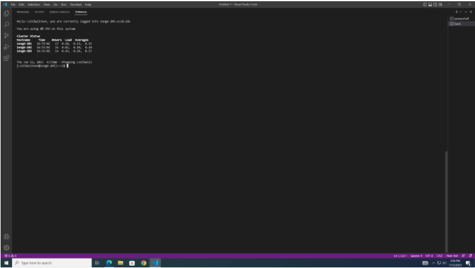
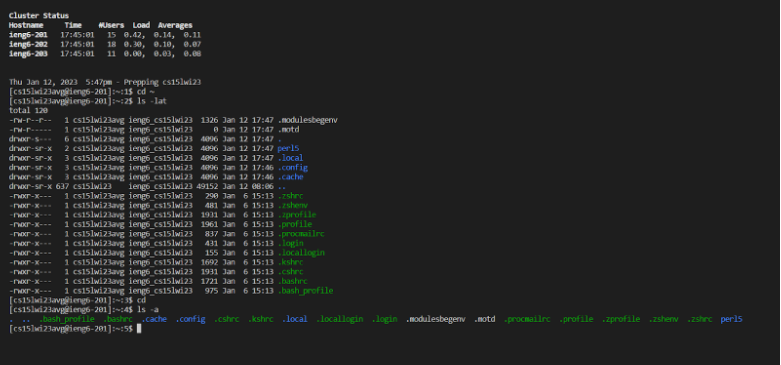

# Lab report 1
## 1. Visual Studio Code
I skipped this step because I have already installed VScode last quarter when I took cse 11 and I've used this for couple months. You should see something like the following screenshot after you finish installing and openning VScode.\

## 2. Remotely Connecting
My computer's system is __windows__, so I installed git on my computer first. If your computer's system is __windows__ just like mine, you will also need to install git on your computer. And here is the download link for git. [Link](https://gitforwindows.org/)
Then open VScode and press __ctrl__ with __`__ to open the terminal. Then press __Ctrl__ with __Shift__ with __P__ to Open the command palette. Then Type in _Select Default Profile_, then select _Git Bash_. Then Click on the __+__ in the terminal window and wait for couple seconds.

Now we just finished our setup and then we can try to use ssh. Open a terminal in VScode. You will see something like this with your __course-specific account__. Then press YES. And you will see something like this.

## 3. Run Some Commands
Now we can try to run some commands like cd, ls, pwd, mkdir, and cp a few times in different ways.\
Here is the list of some commands to try:\
cd ~\
cd\
ls -lat\
ls -a\
ls <directory> where <directory> is /home/linux/ieng6/cs15lwi23/cs15lwi23abc, where the abc is one of the other group members’ username\
cp /home/linux/ieng6/cs15lwi23/public/hello.txt ~/\
cat /home/linux/ieng6/cs15lwi23/public/hello.txt
And you will might see something like this.\

