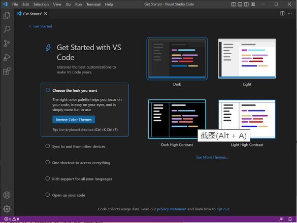

# Lab report 1
## 1. Visual Studio Code
I skipped this step because I have already installed VScode last quarter when I took cse 11 and I've used this for couple months. You should see something like the following screenshot after you finish installing and openning VScode.\

## 2. 
